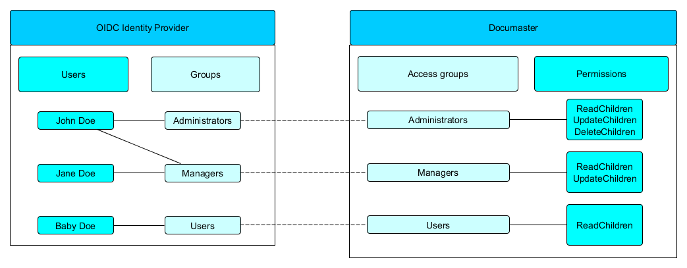

# Introduction

This document provides information about the access control behavior to be expected by Documaster. It will help you get acquainted with the employed group-based permissions management that could be set up with the help of [Access groups](model.md#access-group) and [Explicit permissions](model.md#explicit-permissions)

You can jump right to the section you are interested in:
- [Access control diagram](#access-control-diagram)
- [Access control explained](#access-control-explained)
- [Note on change logs](#note-on-change-logs)

---

# Access control diagram

# Access control explained

The Documaster mandatory access control relies on access groups (defined in Documaster) in order to configure user access to the system. Users are assigned to access groups dynamically based on the user claims returned by the connected OpenID Connect identity provider. As a result, the Documaster access control is tightly coupled to the group membership setup in the configured OpenID Connect identity provider as each access group in Documaster is configured to map to exactly one group in the OpenID Connect identity provider.

By default, when creating a new Access group, that access group will have no access to the data in Documaster. In order for data to be readable, editable, or deletable by the group, [Explicit permissions](model.md#explicit-permissions) must be assigned to the desired [Sections](model.md#section) and [Classifications](model.md#classification). Permissions are "inherited" meaning that the combination of the `ReadObject` and `ReadChildren` permission on a resource will make that resource __and all of its children__ (as described in the [Model](model.md)) readable. The same applies to non-read permissions, such as `CreateChildren`, `UpdateChildren`, etc.

To put this into perspective, in the diagram above:
* John Doe is a member of both "Administrators" and "Managers" in the OIDC IDP
* Jane Doe is a member of "Managers"
* Baby Doe is a member of "Users"

With the above (external to Documaster) configuration in place, one can create the following three access groups in Documaster:
* Administrators
* Managers
* Users

Based on the "claim" attributes of these  access group and considering the fact that the OIDC IDP returns information about the group membership to Documaster, Documaster is able to map the Documaster-based and the IDP-based groups together and grant the described permissions to each user.

# Note on change logs

The change log (revision history) of a resource in Documaster is readable to a user as long as the user has access to the resource whose change log it is reading. In simple terms, a user will be able to see changes to an Entry and its related resources such as Documents and Comments as long as the user has access to the Entry itself.

This implies that an Entry moved from a Section to which a user does not have access to a Section to which the user has access will expose the entire revision history of the Entry to the user, including the part of it that was produced when the Entry was part of the inaccessible Section.